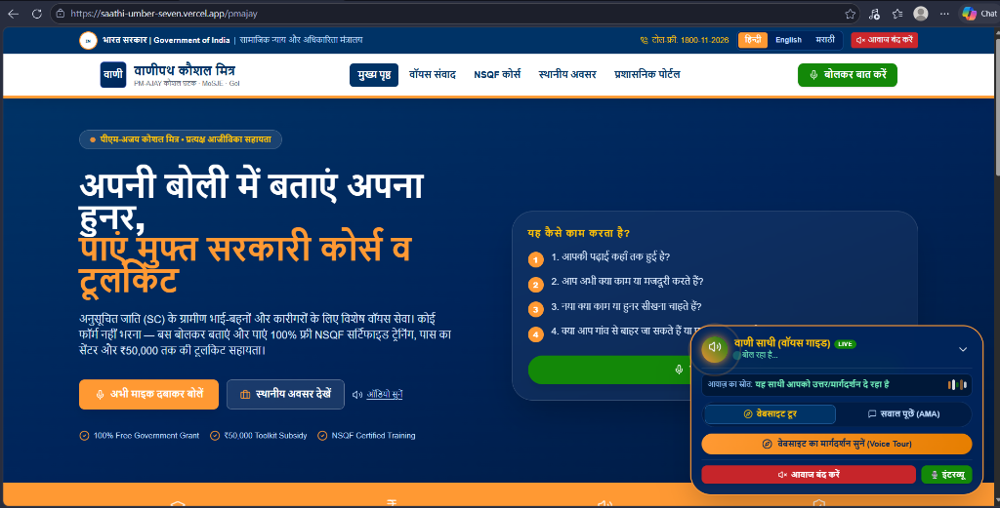
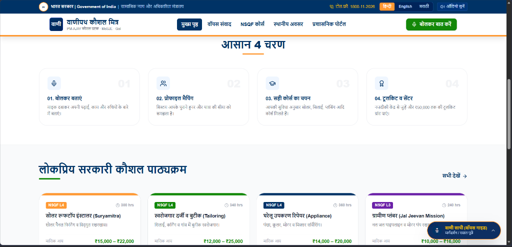
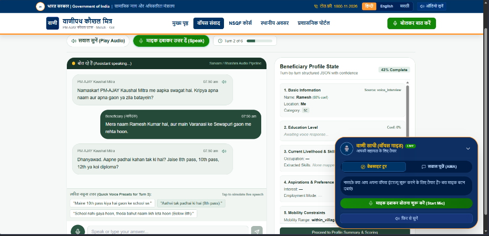
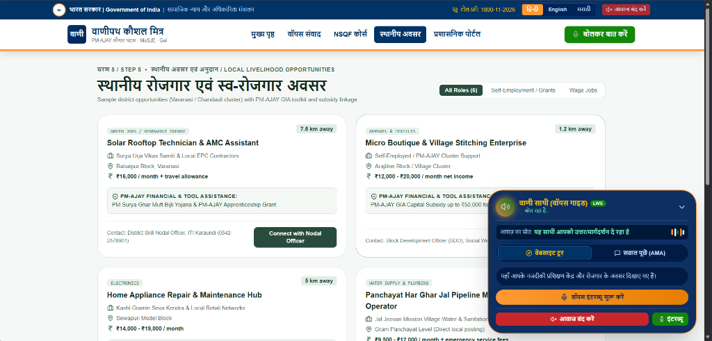
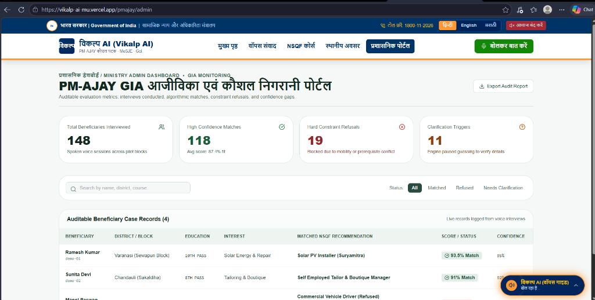

# Vikalp AI

> **AI-Driven Voice Assistant for Livelihood Mapping and NSQF-Aligned Skilling Recommendations for SC Communities under the GIA Component of PM-AJAY**

**Team:** BinaryDNF | **SIH 2026 Problem Statement:** PS ID 26097  
**Ministry:** Social Justice and Empowerment (MoSJE), Government of India  
**Live Demo:** [vikalp-ai-mu.vercel.app/pmajay](https://vikalp-ai-mu.vercel.app/pmajay)

---

## Problem Overview

Scheduled Caste (SC) rural youth, artisans, and women SHGs under the PM-AJAY scheme face critical barriers:

- Cannot navigate complex English-only digital portals or paper forms
- Possess unrecognised informal skills (carpentry, tailoring, electrical helper, farming)
- Face mobility constraints (women restricted to village radius, no interstate travel)
- Generic AI chatbots suggest courses for which they are ineligible or cannot travel to

Existing systems apply no constraint-checking. A beneficiary is matched to a course requiring 3-month residential training 200 km away without knowing they cannot travel beyond their village.

---

## Proposed Solution

**Vikalp AI** is a voice-first, dialect-aware AI assistant that:

1. Conducts a **6-turn structured voice interview** in Hindi, Bhojpuri, Marathi, or English
2. Builds a **transparent beneficiary profile** with field-level confidence scores
3. Runs a **deterministic scoring engine** (6 named weights) — no opaque LLM decisions
4. Applies **hard constraint refusal logic** — refuses courses when mobility or prerequisites conflict
5. Returns **top NSQF-aligned course matches** with plain-language reason, skill gap, and nearest Kaushal Kendra
6. Provides a **Ministry admin audit dashboard** with refusal logs and clarification triggers

---

## Key Features

| Feature | Status |
|---|---|
| Voice interview in Hindi / Bhojpuri / Marathi / English | ✅ Implemented |
| Real-time beneficiary profile with confidence scoring | ✅ Implemented |
| Explainable scoring engine (6 named weights) | ✅ Implemented |
| Hard constraint refusal (mobility, prerequisites) | ✅ Implemented |
| 18 curated NSQF rural qualification packs | ✅ Implemented |
| 40-Hour RPL (Recognition of Prior Learning) Fast-Track | ✅ Implemented |
| Toll-Free 1800-11-2026 Feature Phone IVR Simulator (DTMF Audio) | ✅ Implemented |
| Dynamic "What-If" Scenario Constraint Re-Ranker | ✅ Implemented |
| Printable PM-AJAY Livelihood Passport & Grant Sanction Dossier (QR) | ✅ Implemented |
| Multi-Channel SMS & WhatsApp Alert Dispatch Gateway | ✅ Implemented |
| District cluster opportunities (Varanasi / Chandauli) & Gap Radar | ✅ Implemented |
| Ministry admin audit dashboard & refusal logs | ✅ Implemented |
| GIGW 3.0 Government Design System (Ashoka Emblem, Zero Emojis) | ✅ Implemented |
| AMA voice agent with 10-tier boundary guardrails | ✅ Implemented |
| Sarvam / Bhashini TTS integration (Prototype) | 🟡 Prototype |
| Aadhaar-linked beneficiary verification | 🔵 Planned / Future Scope |

---

## Tech Stack

### Frontend
- **React 18** + **TypeScript** + **Vite** (SPA)
- **Tailwind CSS** + **Lucide React** (UI)
- **Browser Web Speech API** (voice input — zero latency, no GPU)
- **Browser SpeechSynthesis API** (TTS — zero dependency)
- **React Router v6** (multi-screen navigation)
- **Deployed on:** Vercel (Free Tier)

### Backend
- **FastAPI** (Python 3.11)
- **Pydantic v2** (strict beneficiary profile schema)
- **Custom Deterministic Scoring Engine** (no LLM for final decision)
- **SQLite** (session storage — prototype)
- **SlowAPI** (rate limiting)
- **Deployed on:** Render (Free Tier)

### AI / NLP
- **Web Speech API** — browser-native Hindi/Bhojpuri/English ASR
- **Rule-based slot extraction** — confidence scores per interview turn
- **LLM boundary**: Gemini / Groq used only as structured extraction aid, never for scoring decisions

---

## Architecture Summary

```
Beneficiary (Voice Input)
        ↓
  [Web Speech API — Browser ASR]
        ↓
  [6-Turn Interview Engine — FastAPI]
        ↓
  [Beneficiary Profile JSON {value, confidence, source, turn}]
        ↓
  [Constraint Check — Mobility / Prerequisites / Education]
        ↓
  [Deterministic Scoring Engine — 6 Named Weights]
    Interest 25% | Location 20% | Skills 15%
    Education 15% | Market Demand 15% | Mobility 10%
        ↓
  [NSQF-Aligned Pathway — 18 Curated Rural Qualification Packs]
        ↓
  [Nearest Kaushal Kendra + Toolkit Subsidy ₹50,000]
        ↓
  [Ministry Admin Audit Dashboard]
```

See full diagram: [`docs/architecture.md`](docs/architecture.md)

---

## Screenshots

| Screen | Preview |
|---|---|
| Citizen Landing Portal |  |
| 4-Step Process & NSQF Trades |  |
| Voice Interview in Action |  |
| District Opportunities & Subsidies |  |
| Ministry Admin Dashboard |  |

---

## How to Run Locally

### Prerequisites
- Node.js 18+
- Python 3.11+

### Backend
```bash
cd backend
pip install -r requirements.txt
cp .env.example .env          # Fill in your credentials
uvicorn app.main:app --reload --host 0.0.0.0 --port 8000
```

### Frontend
```bash
cd frontend
npm install
cp .env.example .env.local    # Set VITE_API_BASE_URL=http://localhost:8000/api/v1
npm run dev
```

Open: `http://localhost:8080/pmajay`

> **Voice input requires Chrome, Edge, or any Chromium-based browser on desktop/Android.** Safari has partial support.

---

## Repository Structure

```
├── SIH-fresh/
│   ├── backend/        # FastAPI backend — PM-AJAY interview engine
│   │   ├── app/
│   │   │   ├── api/v1/endpoints/pmajay.py   # Core API
│   │   │   ├── services/scoring_engine.py   # Deterministic scoring
│   │   │   ├── services/interview_manager.py
│   │   │   ├── data/nsqf_catalog.py         # 18 NSQF packs
│   │   │   └── schemas/pmajay.py            # Profile schema
│   │   └── render.yaml                      # Render deployment config
│   └── frontend/       # React frontend — 7-screen PM-AJAY UI
│       ├── src/pages/pmajay/     # All 7 active screens
│       ├── src/components/pmajay/
│       ├── src/services/pmajayService.ts
│       └── vercel.json           # SPA routing config
├── docs/
│   ├── screenshots/              # Live prototype screenshots
│   ├── project-report.md
│   └── architecture.md
└── PROJECT_OVERVIEW_MEMORY.md    # Obsidian dev memory
```

---

## Environment Variables

See [`.env.example`](.env.example) for all required variables.  
**Never commit real credentials.**

---

## References

1. Ministry of Social Justice — PM-AJAY Scheme Guidelines, 2023
2. National Skills Qualifications Framework (NSQF) — Ministry of Skill Development, 2015
3. SIH 2026 Problem Statement PS ID 26097 — MoSJE GIA Voice Assistant
4. Sarvam AI — Indic Language ASR & TTS: [sarvam.ai](https://www.sarvam.ai)
5. Bhashini — National Language Technology Mission: [bhashini.gov.in](https://bhashini.gov.in)
6. AI4Bharat — IndicTrans2: [github.com/AI4Bharat/IndicTrans2](https://github.com/AI4Bharat/IndicTrans2)
7. NSQF Qualification Registry (NQR): [nqr.gov.in](https://nqr.gov.in)
8. PM Kaushal Vikas Yojana — Training Centre Network: [pmkvyofficial.org](https://pmkvyofficial.org)

---

## Team

**BinaryDNF** — Smart India Hackathon 2026  
Problem Statement: SIH26097 | Theme: Smart Education | Ministry: MoSJE, GoI
